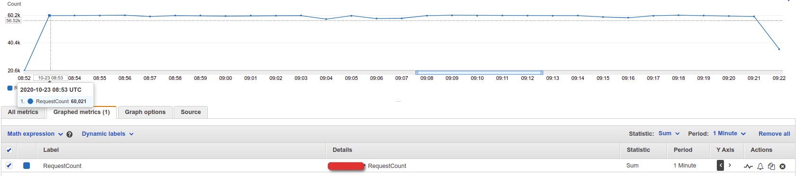
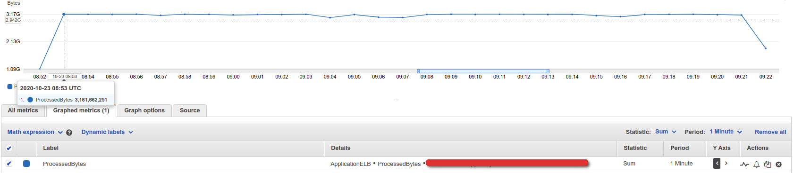

# jmeter-docker-client
## Image on Docker Hub

Docker image for [Apache JMeter](http://jmeter.apache.org).
This Docker image can be run as the ``jmeter`` command. 
Find Images of this repo on [Docker Hub](https://hub.docker.com/r/justb4/jmeter).

### Build Options

Build arguments with default values if not passed to build:

- **JMETER_VERSION** - JMeter version, default ``5.3``
- **JMETER_PLUGINS** - JMeter plugins,
- **IMAGE_TIMEZONE** - timezone of Docker image, default ``"UTC"``

## Running

The Docker image will accept the same parameters as ``jmeter`` itself, assuming
you run JMeter non-GUI with ``-n``.

See for an example of how to call [jmeter-docker-client](https://github.com/dilshan5/jmeter-docker-client-example).

## Specifications

The Docker image built from the 
[Dockerfile](Dockerfile) inherits from the [Alpine Linux](https://www.alpinelinux.org) distribution:

> "Alpine Linux built around musl libc and busybox. This makes it smaller 
> and more resource efficient than traditional GNU/Linux distributions. 
> A container requires no more than 8 MB and a minimal installation to disk 
> requires around 130 MB of storage. 
> Not only do you get a fully-fledged Linux environment but a large selection of packages from the repository."

See https://hub.docker.com/_/alpine/ for Alpine Docker images.

The Docker image will install (via Alpine ``apk``) several required packages most specifically
the ``OpenJDK Java JDK``.  This image use ``OpenJDK 11`` as default Java version. To check the latest OpenJDK version 
used by the ``alpine:3.12``check [Alpine Linux packages](https://pkgs.alpinelinux.org/packages)

JMeter installed by simply downloading/unpacking a ``.tgz`` archive
from https://archive.apache.org/dist/jmeter/binaries/ within the Docker image.

see https://wiki.alpinelinux.org/wiki/Alpine_Linux:Releases Alpine Releases.

## Support SLA

This JMeter docker image has been tested against for 1000 Transactions Per Second(TPS) with a Payload size 50 KB for 30 minutes.

